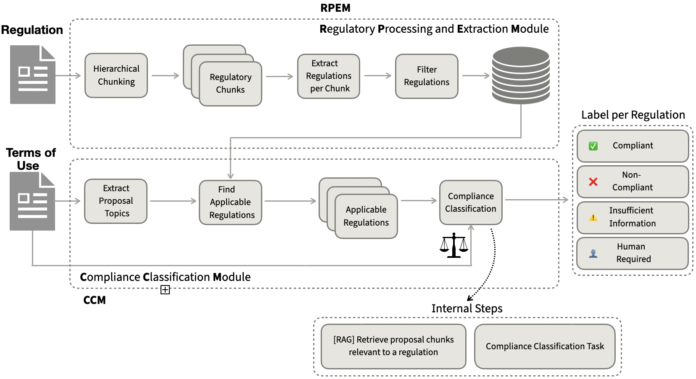

# ⚖️ ARCCS: Automated Regulatory Compliance Classification System

<p align="center">
  
</p>

## Abstract

> This paper introduces ARCCS, a multi-agent system for regulation-level compliance assessment. The architecture consists of two coordinated modules, the Regulatory Processing and Extraction Module (RPEM) and the Compliance Classification Module (CCM), which jointly support the structured analysis of regulatory texts and proposal documents. The system produces interpretable compliance outputs in the form of regulation-level labels, associated confidence scores, and structured explanations that justify each assessment. ARCCS is designed to provide a scalable and transparent framework for automated compliance analysis across complex regulatory and technical domains.

---

## 📋 Table of Contents

- [Overview](#overview)
- [System Architecture](#system-architecture)
- [Features](#features)
- [Installation](#installation)
- [Quick Start](#quick-start)
- [Usage](#usage)
  - [Jupyter Notebook Demo](#jupyter-notebook-demo)
  - [Web Application](#web-application)
- [API Reference](#api-reference)
- [Project Structure](#project-structure)
- [Example Data](#example-data)
- [Output Format](#output-format)
- [Configuration](#configuration)
- [Troubleshooting](#troubleshooting)
- [License](#license)

---

## Overview

**ARCCS** (Automated Regulatory Compliance Classification System) is a multi-agent AI system designed for regulation-level compliance assessment. The system automatically analyzes legal documents against regulatory frameworks (such as GDPR) and produces interpretable compliance outputs.

### Key Capabilities

- 📄 **Automated PDF Parsing**: Extracts and structures content from regulatory documents
- 🤖 **AI-Powered Regulation Extraction**: Uses LLMs to identify and structure individual regulations
- ⚖️ **Compliance Classification**: Checks documents against extracted regulations using contradiction detection
- 📊 **Detailed Reporting**: Generates comprehensive compliance reports with explanations and evidence

### Compliance Classification Labels

The system employs a **contradiction-based approach** for compliance classification:

| Label | Description |
|-------|-------------|
| ✅ **COMPLIANT** | No contradiction found between the document and the regulation |
| ❌ **NON_COMPLIANT** | A direct contradiction was detected (document states X, regulation requires Y) |

This binary classification focuses on identifying clear violations where the document explicitly contradicts regulatory requirements.

---

## System Architecture

ARCCS consists of two coordinated modules that work together in a pipeline:

```
┌─────────────────────────────────────────────────────────────────────┐
│                          ARCCS Pipeline                              │
├─────────────────────────────────────────────────────────────────────┤
│                                                                      │
│   ┌─────────────┐      ┌─────────────┐      ┌──────────────────┐   │
│   │  Regulation │  →   │    RPEM     │  →   │  Extracted       │   │
│   │  PDF (GDPR) │      │   Module    │      │  Regulations     │   │
│   └─────────────┘      └─────────────┘      └────────┬─────────┘   │
│                                                       │              │
│   ┌─────────────┐                                    ↓              │
│   │  Terms of   │      ┌─────────────┐      ┌──────────────────┐   │
│   │  Service    │  →   │    CCM      │  →   │  Compliance      │   │
│   │  Document   │      │   Module    │      │  Report          │   │
│   └─────────────┘      └─────────────┘      └──────────────────┘   │
│                                                                      │
└─────────────────────────────────────────────────────────────────────┘
```

### 1. RPEM - Regulatory Processing and Extraction Module

The RPEM module (`RPEM.py`) handles the processing of regulatory documents:

| Function | Description |
|----------|-------------|
| `load_pdf_document()` | Parses PDF files using the `unstructured` library |
| `elements_to_markdown()` | Converts parsed elements to structured markdown |
| `split_into_sections()` | Segments documents by headers, articles, and chapters |
| `extract_regulations_from_section()` | LLM-powered extraction of structured regulations |
| `process_all_sections()` | Batch processes all sections with progress tracking |
| `filter_regulations_by_quality()` | Scores and filters regulations by completeness |

### 2. CCM - Compliance Classification Module

The CCM module (`CCM.py`) performs compliance assessment:

| Function | Description |
|----------|-------------|
| `check_regulation_compliance()` | Checks a single regulation against a document |
| `check_all_regulations()` | Batch checks all regulations with progress tracking |
| `generate_compliance_report()` | Creates comprehensive summary report |
| `print_detailed_report()` | Pretty-prints the report to console |
| `export_report_to_json()` | Exports report to JSON file |

---

## Features

### Core Features
- 🔍 **Deep Regulation Analysis**: Extracts requirements, restrictions, obligations, and conditions
- 📝 **Evidence-Based Results**: Each finding includes supporting evidence quotes from documents
- 🎯 **Confidence Scoring**: Provides confidence scores (0.0-1.0) for each assessment
- 💾 **Export Capabilities**: Export reports in JSON format

### Web Application Features
- 🌐 **Modern Web Interface**: User-friendly 3-step wizard with dark theme
- ⚡ **Real-Time Streaming**: Live log output during processing via Server-Sent Events (SSE)
- 🔎 **Interactive Results**: Click on any result to view full details in a modal
- 📤 **Drag & Drop Upload**: Easy file upload with drag-and-drop support
- 📊 **Visual Statistics**: Compliance rate visualization and status indicators

### Research Features
- 📓 **Jupyter Notebook Demo**: Full interactive demonstration for research
- 🔧 **Modular Design**: Easy to extend and customize
- 📋 **Structured Output**: JSON-formatted results for further analysis

---

## Installation

### Prerequisites

- Python 3.10 or higher
- OpenAI API key
- poppler-utils (for PDF parsing)

### Step 1: Clone the Repository

```bash
git clone https://github.com/yourusername/arccs.git
cd arccs
```

### Step 2: Create Virtual Environment (Recommended)

```bash
python -m venv venv
source venv/bin/activate  # On Windows: venv\Scripts\activate
```

### Step 3: Install System Dependencies

**macOS:**
```bash
brew install poppler
```

**Ubuntu/Debian:**
```bash
sudo apt-get install poppler-utils
```

**Windows:**
Download poppler from [poppler releases](https://github.com/osber/win-builds/releases) and add to PATH.

### Step 4: Install Python Dependencies

```bash
pip install -r requirements.txt
```

**Required packages:**
```
flask>=2.3.0
openai>=1.0.0
unstructured[pdf]>=0.10.0
python-multipart
pydantic
```

### Step 5: Set OpenAI API Key

```bash
export OPENAI_API_KEY="your-api-key-here"
```

Or add to your shell configuration (`~/.zshrc` or `~/.bashrc`):
```bash
echo 'export OPENAI_API_KEY="your-api-key-here"' >> ~/.zshrc
source ~/.zshrc
```

---

## Quick Start

### Option 1: Web Application (Recommended for Users)

```bash
python app.py
```

Open your browser at: **http://localhost:5000**

### Option 2: Jupyter Notebook (Recommended for Research)

```bash
jupyter notebook demo.ipynb
```

### Option 3: Command Line

```python
from RPEM import load_pdf_document, process_all_sections, filter_regulations_by_quality
from CCM import check_all_regulations, generate_compliance_report

# Process regulation document
elements = load_pdf_document("gdpr.pdf")
# ... extract and filter regulations ...

# Run compliance check
results = check_all_regulations(regulations, document_text)
report = generate_compliance_report(results)
```

---

## Usage

### Jupyter Notebook Demo

The `demo.ipynb` notebook provides a comprehensive step-by-step walkthrough:

#### Cell 1: Setup & Configuration
```python
import openai
openai.api_key = "YOUR_OPENAI_API_KEY"

# Import modules
from RPEM import (
    load_pdf_document, 
    elements_to_markdown, 
    split_into_sections,
    process_all_sections, 
    collect_all_regulations, 
    filter_regulations_by_quality
)
from CCM import (
    check_all_regulations, 
    generate_compliance_report, 
    print_detailed_report
)
```

#### Cell 2: Load and Parse Regulation PDF
```python
# Load GDPR document
elements = load_pdf_document("./Example Data/Regulations/GDPR.pdf")
print(f"Extracted {len(elements)} elements from PDF")

# Convert to markdown
markdown_text = elements_to_markdown(elements)

# Split into sections
sections = split_into_sections(markdown_text)
print(f"Split into {len(sections)} sections")
```

#### Cell 3: Extract Regulations with AI
```python
# Process all sections (this calls the LLM)
analysis_results = process_all_sections(
    sections=sections,
    model="gpt-4",
    verbose=True  # Shows progress
)

# Collect all extracted regulations
all_regulations = collect_all_regulations(analysis_results)
print(f"Extracted {len(all_regulations)} total regulations")
```

#### Cell 4: Filter by Quality
```python
# Filter regulations by quality score
filtered = filter_regulations_by_quality(
    regulations=all_regulations,
    min_score=40,  # Minimum quality score
    verbose=True
)

regulations = filtered["kept"]
print(f"Kept {len(regulations)} high-quality regulations")
```

#### Cell 5: Load Document for Compliance Check
```python
# Load Terms of Service document
with open("./Example Data/Terms of Use/WhatsApp.txt", "r") as f:
    terms_text = f.read()

print(f"Loaded document: {len(terms_text)} characters")
```

#### Cell 6: Run Compliance Check
```python
# Check compliance against all regulations
results = check_all_regulations(
    regulations=regulations,
    proposal_chunk=terms_text,
    model="gpt-4",
    verbose=True
)

# Generate report
report = generate_compliance_report(results)
print_detailed_report(report)
```

#### Cell 7: Export Results
```python
from CCM import export_report_to_json

export_report_to_json(report, "compliance_report.json")
print("Report exported successfully!")
```

---

### Web Application

The web application provides an intuitive 3-step wizard interface:

#### Step 1: Upload Regulation Document

1. **Upload a file**: Drag & drop or click to browse
   - Supported formats: PDF, TXT, JSON
   - The system will parse and extract regulations automatically

2. **Or use pre-loaded GDPR**: Click "Load GDPR Regulations" to use pre-extracted GDPR regulations (saves processing time)

3. **Monitor progress**: Watch the real-time console for extraction progress

#### Step 2: Upload Proposal Document

1. Upload the Terms of Service or other document to check
2. Supported formats: PDF, TXT
3. Click "Continue to Step 3" when ready

#### Step 3: Run Compliance Check

1. Review the summary showing number of regulations to check
2. Click **"Run Compliance Check"** to start analysis
3. Watch real-time progress in the console
4. View results in the results table

#### Viewing Results

- **Click any result row** to open a detailed modal showing:
  - Regulation name and ID
  - Domain classification
  - Full compliance status
  - Contradiction details (if non-compliant)
  - Evidence quotes from the document
  - Complete explanation
  - Confidence score

#### Export Report

Click **"Export Report"** to download the complete compliance report as JSON.

---

## API Reference

### RPEM Module Functions

#### `load_pdf_document(filepath, strategy="hi_res")`
Loads and parses a PDF document using the unstructured library.

**Parameters:**
| Name | Type | Default | Description |
|------|------|---------|-------------|
| `filepath` | str | required | Path to the PDF file |
| `strategy` | str | "hi_res" | Parsing strategy: "hi_res", "fast", or "auto" |

**Returns:** `List[Element]` - List of parsed document elements

---

#### `elements_to_markdown(elements)`
Converts parsed elements to structured markdown text.

**Parameters:**
| Name | Type | Description |
|------|------|-------------|
| `elements` | List[Element] | Elements from load_pdf_document |

**Returns:** `str` - Markdown-formatted text

---

#### `split_into_sections(markdown_text)`
Splits markdown text into logical sections based on headers.

**Parameters:**
| Name | Type | Description |
|------|------|-------------|
| `markdown_text` | str | Markdown text from elements_to_markdown |

**Returns:** `List[Dict]` - List of sections with 'title' and 'content' keys

---

#### `extract_regulations_from_section(section, model="gpt-4")`
Extracts structured regulations from a single section using AI.

**Parameters:**
| Name | Type | Default | Description |
|------|------|---------|-------------|
| `section` | Dict | required | Section with 'title' and 'content' |
| `model` | str | "gpt-4" | OpenAI model to use |

**Returns:** `Dict` - Extracted regulations with metadata

---

#### `process_all_sections(sections, model="gpt-4", verbose=True)`
Processes all sections and extracts regulations with progress tracking.

**Parameters:**
| Name | Type | Default | Description |
|------|------|---------|-------------|
| `sections` | List[Dict] | required | List of sections |
| `model` | str | "gpt-4" | OpenAI model to use |
| `verbose` | bool | True | Print progress information |

**Returns:** `List[Dict]` - List of analysis results per section

---

#### `filter_regulations_by_quality(regulations, min_score=40, verbose=True)`
Filters regulations by quality score.

**Parameters:**
| Name | Type | Default | Description |
|------|------|---------|-------------|
| `regulations` | List[Dict] | required | List of extracted regulations |
| `min_score` | int | 40 | Minimum quality score (0-100) |
| `verbose` | bool | True | Print filtering statistics |

**Returns:** `Dict` - Dictionary with "kept" and "review" regulation lists

---

### CCM Module Functions

#### `check_regulation_compliance(regulation, proposal_chunk, model="gpt-4")`
Checks a document against a single regulation for compliance.

**Parameters:**
| Name | Type | Default | Description |
|------|------|---------|-------------|
| `regulation` | Dict | required | Regulation to check against |
| `proposal_chunk` | str | required | Document text to analyze |
| `model` | str | "gpt-4" | OpenAI model to use |

**Returns:** `Dict` - Compliance result with status, evidence, and explanation

---

#### `check_all_regulations(regulations, proposal_chunk, model="gpt-4", verbose=True)`
Checks a document against multiple regulations.

**Parameters:**
| Name | Type | Default | Description |
|------|------|---------|-------------|
| `regulations` | List[Dict] | required | List of regulations |
| `proposal_chunk` | str | required | Document text to analyze |
| `model` | str | "gpt-4" | OpenAI model to use |
| `verbose` | bool | True | Print progress information |

**Returns:** `List[Dict]` - List of compliance check results

---

#### `generate_compliance_report(results)`
Generates a comprehensive compliance report from results.

**Parameters:**
| Name | Type | Description |
|------|------|-------------|
| `results` | List[Dict] | List of compliance check results |

**Returns:** `Dict` - Complete report with summary, violations, and details

---

#### `export_report_to_json(report, filepath)`
Exports the compliance report to a JSON file.

**Parameters:**
| Name | Type | Description |
|------|------|-------------|
| `report` | Dict | Report from generate_compliance_report |
| `filepath` | str | Output file path |

---

## Project Structure

```
ARCCS/
│
├── 📄 Core Modules
│   ├── RPEM.py                      # Regulatory Processing and Extraction Module
│   ├── CCM.py                       # Compliance Classification Module
│   └── app.py                       # Flask web application server
│
├── 📓 Documentation & Demo
│   ├── README.md                    # This documentation file
│   ├── demo.ipynb                   # Interactive Jupyter notebook demo
│   ├── pipeline.png                 # System architecture diagram
│   └── 2404.17522v1.pdf            # Reference paper
│
├── 🔧 Utilities
│   ├── filter_regulations_funcs.py  # Quality filtering utilities
│   └── merge_regulations.py         # Regulation deduplication utilities
│
├── 📦 Configuration
│   └── requirements.txt             # Python dependencies
│
├── 🌐 Web Application
│   ├── templates/
│   │   └── index.html               # Main HTML template
│   └── static/
│       ├── css/
│       │   └── style.css            # Application styles (dark theme)
│       └── js/
│           └── app.js               # Frontend JavaScript (SSE, modals)
│
├── 📁 Example Data
│   ├── gdpr.pdf                     # Full GDPR regulation document
│   ├── chatgpt_terms_of_use.txt     # ChatGPT Terms of Service
│   ├── netflix_terms_of_use.txt     # Netflix Terms of Service
│   └── whatsup_terms_of_use.txt     # WhatsApp Terms of Service
│
├── 📊 Output Files (Generated)
│   ├── extracted_regulations.json   # Extracted regulations from RPEM
│   ├── deduplicated_regulations.json# Deduplicated regulations
│   ├── analysis_gdpr.json           # GDPR analysis results
│   └── compliance_report.json       # Final compliance report
│
└── 📂 Runtime
    └── uploads/                     # Uploaded files (auto-created)
```

---

## Example Data

The repository includes example data for testing and demonstration:

### Regulation Documents
| File | Description |
|------|-------------|
| `gdpr.pdf` | Complete General Data Protection Regulation (EU) 2016/679 |

### Terms of Service Documents
| File | Description |
|------|-------------|
| `whatsup_terms_of_use.txt` | WhatsApp Terms of Service |
| `netflix_terms_of_use.txt` | Netflix Terms of Service |
| `chatgpt_terms_of_use.txt` | OpenAI/ChatGPT Terms of Service |

These documents can be used to test the compliance checking pipeline:
```python
# Example: Check WhatsApp ToS against GDPR
results = check_all_regulations(gdpr_regulations, whatsapp_terms)
```

---

## Output Format

### Extracted Regulation Structure

Each regulation extracted by RPEM has the following structure:

```json
{
  "regulation_id": "GDPR-Art-17-1",
  "regulation_name": "Right to erasure ('right to be forgotten')",
  "source_section": "Article 17",
  "description": {
    "brief_summary": "Data subjects have the right to obtain erasure of personal data",
    "detailed_explanation": "The data subject shall have the right to obtain from the controller the erasure of personal data concerning him or her without undue delay..."
  },
  "requirements": {
    "mandatory": [
      "Controller must erase personal data without undue delay",
      "Must inform other controllers processing the data"
    ],
    "conditional": [
      "Applies when data is no longer necessary for original purpose",
      "Applies when consent is withdrawn"
    ]
  },
  "restrictions": {
    "prohibited_actions": [
      "Cannot retain data without valid legal basis"
    ],
    "limitations": [
      "Right does not apply if processing is necessary for legal claims"
    ]
  },
  "domain": {
    "primary_domain": "Data Protection",
    "sub_domains": ["Privacy Rights", "Data Subject Rights", "Data Erasure"]
  },
  "keywords": ["erasure", "deletion", "right to be forgotten", "personal data"],
  "quality_score": 85
}
```

### Compliance Check Result Structure

Each compliance check produces:

```json
{
  "regulation_id": "GDPR-Art-17-1",
  "regulation_name": "Right to erasure ('right to be forgotten')",
  "compliance_status": "NON_COMPLIANT",
  "contradiction_details": "Document specifies 30-day deletion period while GDPR requires deletion 'without undue delay'",
  "evidence": "\"We will process your deletion request within 30 calendar days of receiving your verified request.\"",
  "explanation": "The document's 30-day timeline may not satisfy GDPR's requirement for erasure 'without undue delay', which typically implies a shorter timeframe unless complexity justifies extension.",
  "confidence_score": 0.78,
  "domain": "Data Protection"
}
```

### Compliance Report Structure

The final report includes:

```json
{
  "overall_status": "❌ NON-COMPLIANT - 3 violation(s) found",
  "summary": {
    "compliant": 47,
    "non_compliant": 3,
    "total": 50,
    "compliance_rate": 94.0
  },
  "violations": [
    {
      "regulation_id": "GDPR-Art-17-1",
      "regulation_name": "Right to erasure",
      "compliance_status": "NON_COMPLIANT",
      "contradiction_details": "...",
      "evidence": "...",
      "explanation": "...",
      "confidence_score": 0.78
    }
  ],
  "detailed_results": [
    // All regulation check results
  ],
  "generated_at": "2024-01-15T10:30:00Z"
}
```

---

## Configuration

### Model Selection

Configure the LLM model in the code:

```python
# In app.py - default model for web application
DEFAULT_MODEL = "gpt-4"

# Available options:
# - "gpt-4"           (recommended for accuracy)
# - "gpt-4-turbo"     (faster, good accuracy)
# - "gpt-3.5-turbo"   (fastest, lower accuracy)
```

### Quality Score Threshold

The quality filter determines which regulations are used:

```python
# Higher threshold = fewer but higher quality regulations
filtered = filter_regulations_by_quality(regulations, min_score=60)

# Lower threshold = more regulations, may include lower quality
filtered = filter_regulations_by_quality(regulations, min_score=30)

# Recommended range: 40-60
```

### PDF Parsing Strategy

```python
# High resolution - best quality, slower
elements = load_pdf_document("doc.pdf", strategy="hi_res")

# Fast - lower quality, faster
elements = load_pdf_document("doc.pdf", strategy="fast")

# Auto - automatically chooses based on document
elements = load_pdf_document("doc.pdf", strategy="auto")
```

---

## Troubleshooting

### Common Issues

#### 1. PDF Parsing Errors

**Error:** `Unable to partition PDF`

**Solution:**
```bash
# Install PDF dependencies
pip install "unstructured[pdf]"

# macOS
brew install poppler tesseract

# Ubuntu
sudo apt-get install poppler-utils tesseract-ocr
```

#### 2. OpenAI API Errors

**Error:** `AuthenticationError` or `RateLimitError`

**Solution:**
- Verify API key is set correctly: `echo $OPENAI_API_KEY`
- Check API rate limits in OpenAI dashboard
- Ensure sufficient API credits

#### 3. Memory Issues with Large PDFs

**Error:** `MemoryError` or slow processing

**Solution:**
```python
# Use fast parsing strategy
elements = load_pdf_document("large_doc.pdf", strategy="fast")

# Or process fewer sections at a time
sections = split_into_sections(markdown_text)
sections_subset = sections[:10]  # Process first 10 only
```

#### 4. Module Import Errors

**Error:** `ModuleNotFoundError: No module named 'RPEM'`

**Solution:**
Ensure you're running from the project root directory:
```bash
cd /path/to/arccs
python app.py
```

#### 5. Web Application Won't Start

**Error:** Port already in use

**Solution:**
```bash
# Find process using port 5000
lsof -i :5000

# Kill the process or use different port
python app.py --port 5001
```

---

## Tech Stack

| Component | Technology |
|-----------|------------|
| **Backend** | Python 3.10+, Flask |
| **AI/LLM** | OpenAI GPT-4 API |
| **PDF Parsing** | Unstructured.io |
| **Frontend** | HTML5, CSS3, Vanilla JavaScript |
| **Real-time Updates** | Server-Sent Events (SSE) |
| **Fonts** | Inter (Google Fonts) |
| **Icons** | Font Awesome 6 |

---

## License

[Add your license information here]

---

## Citation

If you use ARCCS in your research, please cite:

```bibtex
@software{arccs2024,
  title={ARCCS: Automated Regulatory Compliance Classification System},
  author={[Your Name]},
  year={2024},
  url={https://github.com/yourusername/arccs}
}
```

---

## Acknowledgments

- OpenAI for providing GPT models
- Unstructured.io for PDF parsing capabilities
- Flask team for the web framework

---

<p align="center">
  <strong>⚖️ ARCCS</strong>
  <br>
  Automated Regulatory Compliance Classification System
  <br><br>
  <em>Making compliance checking accessible, interpretable, and automated</em>
</p>
